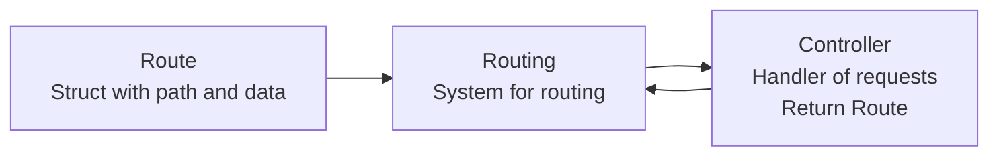
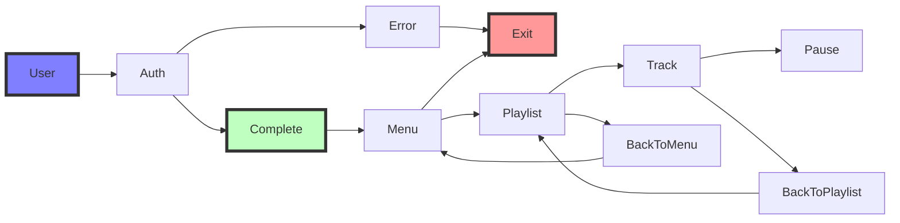

# audio-player

### Infra

```mermaid
    flowchart LR 
    Route["Route <br/> Struct with path and data"] --> Routing["Routing <br/>System for routing"] --> Controller["Controller <br/> Handler of requests <br/> Return Route"] --> Routing 
```

### Actual flow

```mermaid
    flowchart LR
    User --> Auth
    Auth --> Error
    Error --> Exit
    Auth --> Complete
    
    style User fill:#7f7fff,stroke:#333,stroke-width:4px
    style Exit fill:#ff9999,stroke:#333,stroke-width:4px
    style Complete fill: #bfffbf,stroke:#333,stroke-width:4px
    
    Complete --> Menu
    Menu --> Exit
    
    Menu --> Playlist
    Playlist --> Track
    Playlist --> BackToMenu
    BackToMenu --> Menu
    
    Track --> Pause
    Track --> BackToPlaylist
    BackToPlaylist --> Playlist
```
