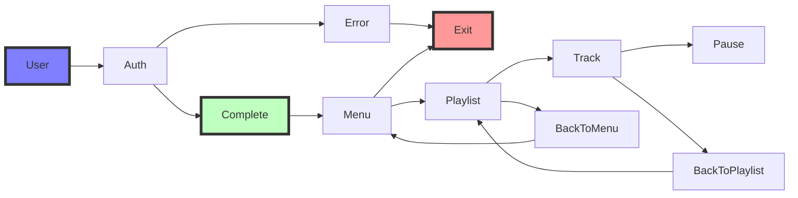
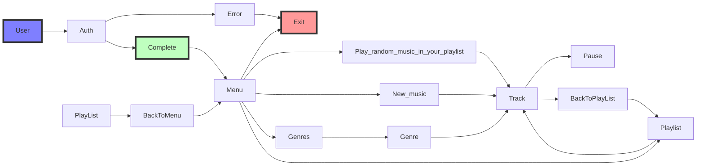
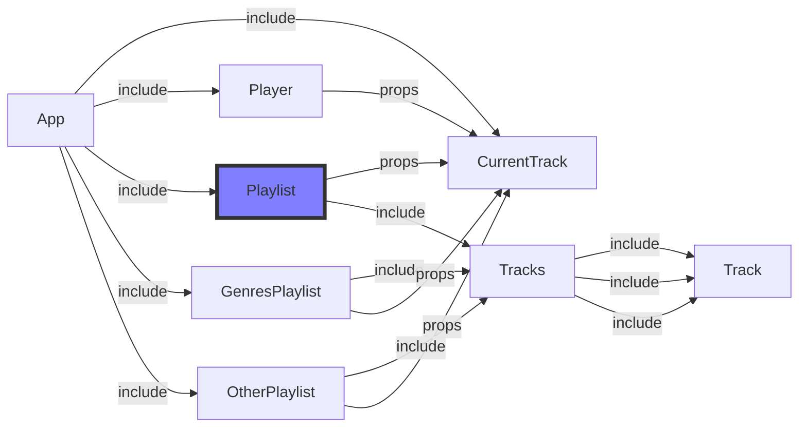

# audio-player
### Actual flow

```mermaid
    flowchart LR
    User --> Auth
    Auth --> Error
    Error --> Exit
    Auth --> Complete
    
    style User fill:#7f7fff,stroke:#333,stroke-width:4px
    style Exit fill:#ff9999,stroke:#333,stroke-width:4px
    style Complete fill: #bfffbf,stroke:#333,stroke-width:4px
    
    Complete --> Menu
    Menu --> Exit
    
    Menu --> Playlist
    Playlist --> Track
    Playlist --> BackToMenu
    BackToMenu --> Menu
    
    Track --> Pause
    Track --> BackToPlaylist
    BackToPlaylist --> Playlist
```

### Flow for the future

```mermaid
    flowchart LR
    User --> Auth
    Auth --> Error
    Error --> Exit
    Auth --> Complete
    
    style User fill:#7f7fff,stroke:#333,stroke-width:4px
    style Exit fill:#ff9999,stroke:#333,stroke-width:4px
    style Complete fill: #bfffbf,stroke:#333,stroke-width:4px
    
    Complete --> Menu
    Menu --> Exit
    
    Menu --> Play_random_music_in_your_playlist
    Play_random_music_in_your_playlist --> Track
    Menu --> New_music
    Menu --> Genres
    Menu --> Playlist
    Genres --> Genre
    Genre --> Track
    New_music --> Track
    Playlist --> Track
    PlayList --> BackToMenu
    BackToMenu --> Menu
    
    Track --> Pause
    Track --> BackToPlayList
    BackToPlayList --> Playlist
```

### Entities

```mermaid
    flowchart LR
    App -- include --> CurrentTrack
    App -- include --> Player
    App -- include --> Playlist
    App -- include --> GenresPlaylist -- include --> Tracks -- include --> Track
    App -- include --> OtherPlaylist -- include --> Tracks -- include --> Track
    Playlist -- props --> CurrentTrack
    Player -- props --> CurrentTrack
    GenresPlaylist -- props --> CurrentTrack
    OtherPlaylist -- props --> CurrentTrack
    Playlist -- include --> Tracks -- include --> Track
    
    
    style Playlist fill:#7f7fff,stroke:#333,stroke-width:4px
```